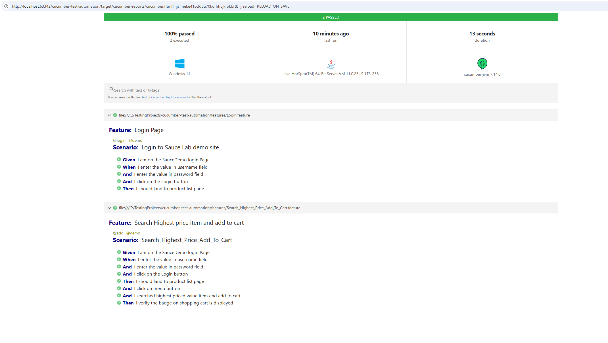

# Cucumber Test Automation

This repository contains a **Cucumber-based test automation framework** designed to automate the testing of web applications Sauce lab using the **BDD (Behavior Driven Development)** approach. It integrates with **JUnit** for running tests and generating reports.

---

## **Project Overview**

The `cucumber-test-automation` project is intended to provide an automated testing solution for the test exercise to find Add the selected highest price item to the cart. 

---

## **Features**

- **BDD (Behavior-Driven Development)** with **Cucumber**.
- Support for writing **Feature files** using Gherkin syntax.
- Step definitions in **Java**.
- Generates **HTML and JSON reports**.
- Integrates with **JUnit** for executing tests.
- Supports **Tag-based execution** to run specific tests.
- Easy integration with **Maven** for building and running tests.

---

## **Project Setup**

### **Pre-requisites**

Before you start, ensure you have the following installed on your system:

- **Java 11 or higher** (To check version: `java -version`).
- **Maven 3.6.0 or higher** (To check version: `mvn -v`).
- **JUnit** for running tests.
- **Cucumber** and related dependencies.

---

### ** Report Screenshot **

### **Run the tests**

use the maven command mvn clean test  to run the tests. 

